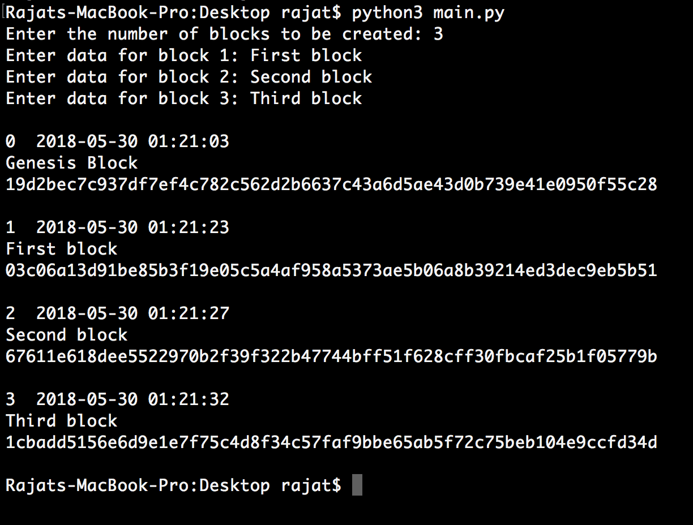

# Blockchain
A simple blockchain implementation using Python


There are 3 files in this repository:

- ### main.py

    This is the main file that is used to run the program.
    Asks the user to input the number of blocks to add and then asks for the data for each of those blocks.  

    The output of the file is as follows:
```
  index  time_of_block_creation
  data_entered
  block_sha256_hash
```

- ### block.py

    Contains the Block class.
    Has a `calculate_hash` method that creates an SHA-256 hash using the index, timestamp, previous hash and the data entered and returns it.
    Also has a `real_time` method that simply takes the timestamp and prints it out as readable date and time.
    
- ### blockchain.py
    
    The `__init__` method creates a new list with a genesis block.  
    Contains `is_valid` method that checks if the new block has the correct hash and whether it is allowed to be added to the blockchain.  
    The `add_block` method appends a new block to the chain if and only if it is valid (checked by `is_valid`).  
    The `print_blockchain` method simply pretty prints the complete chain as shown in __main.py__.  
    


_Running the program in the terminal_
